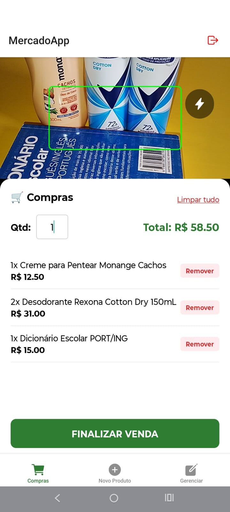
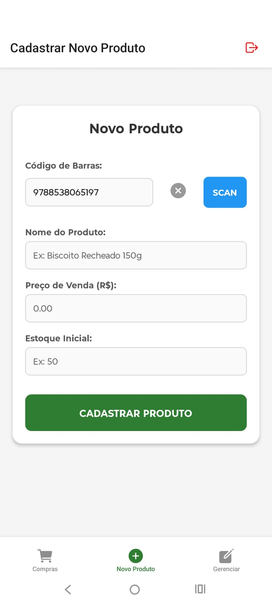
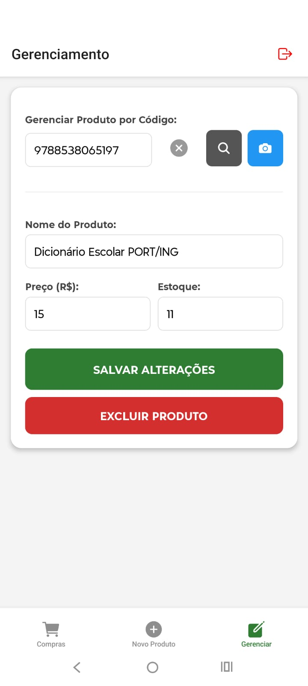

<h1 align="center"> Mobile PDV </h1>

<p align="center">Sistema Full-Stack que automatiza o processo de vendas ao realizar leitura de códigos de barras de produtos.</p>

---

<p align="center">
  <video src="assets/mobile_pdv.mp4" width="500" controls>
    Pode ser que seu navegador não suporte o player de vídeo.
  </video>
</p>

## Sobre o Projeto

O processo de automatização de tarefas cotidianas por meio das tecnologias mais recentes se tornou cada vez mais comum. Entretanto, ainda existem estabelecimentos que não têm acesso a sistemas que auxiliam no gerenciamento das vendas. Nesse sentido, o Mobile PDV foi criado como solução de acessibilidade para automatizar a venda de produtos por meio da leitura de códigos EAN-13. Além disso, o app permite o cadastro de novos produtos, a edição e a exclusão, quando convir.

---

## Tecnologias

### **Frontend**

- **React Native & Expo:** Framework para interface nativa.
- **EAS Build:** Pipeline de compilação para geração de `.apk`.
- **Axios:** Comunicação assíncrona com a API.

### **Backend**

- **Python & FastAPI:** Alta performance e documentação automática (Swagger).
- **Gunicorn/Uvicorn:** Servidores de produção para Python.
- **Render:** Hospedagem em nuvem do serviço de API.
- **PostgreSQL:** Banco relacional hospedado na **Neon.tech**.

---

## Guia do App

Para acessar o app, baixe o arquivo `.apk` clicando em <a href="https://github.com/kenandjak/Mobile_PDV/releases/tag/v1.0.0">mobile_pdv.apk</a>. Caso necessário, consulte a documentação <a href="https://mobile-pdv.onrender.com/docs#/">Swagger</a>.

Nota: O serviço utiliza o plano gratuito do Render. Desse modo, o servidor entra em modo de espera após inatividade. Assim, ao abrir o app, aguarde cerca de 50 segundos ou faça um scan de teste para "despertar" o servidor.

<table>
  <tr>
    <td width="70%">
      <h3>1. Realizando uma Venda</h3>
      <ol>
        <li>Na tela inicial, se houver mais de um produto com o mesmo código, ajuste o campo <strong>Qtd</strong> para colocar a quantidade de itens;</li>
        <li>Aponte a câmera para o código de barras do produto;</li>
        <li>O item aparecerá na lista com o subtotal calculado;</li>
        <li> Clique em <strong>Finalizar Venda</strong> para decrementar os itens do estoque e registrar a transação.</li>
      </ol>
    </td>
    <td width="30%">
      
    </td>
  </tr>
  <tr>
    <td width="70%">
      <h3>2. Cadastrando Novos Produtos</h3>
      <ol>
        <li>Acesse a aba <strong>Novo Produto</strong>;</li>
        <li>Digite ou use o botão <strong>SCAN</strong> para ler o código do novo produto;</li>
        <li>Preencha o <strong>Nome</strong>, o <strong>Preço de Venda</strong> e o <strong>Estoque Inicial</strong>;</li>
        <li>Clique em <strong>Cadastrar Produto</strong>.</li>
      </ol>
    </td>
     <td width="30%">
      
    </td>
  </tr>
  <tr>
    <td width="70%">
      <h3>3. Gerenciamento</h3>
      <ol>
        <li>Acesse a aba <strong>Gerenciar</strong>;</li>
        <li>Digite ou use o botão com o ícone da câmera para escanear o código;</li>
        <li>Os dados atuais serão carregados automaticamente;</li>
        <li>Realize as alterações e clique em <strong>Salvar Alterações</strong> ou;</li>
        <li>Use o botão <strong>Excluir Produto</strong> para excluir o produto que não tem venda registrada.</li>
      </ol>
    </td>
     <td width="30%">
      
    </td>
  </tr>
</table>

---

## Configuração de Desenvolvimento

### Pré-requisitos

- Python 3
- Node.js & npm
- Expo Go instalado no celular

### Instalação Local

1.  **Clone o repositório:**

    ```bash
    git clone https://github.com/kenandjak/Mobile_PDV
    ```

2.  **Configure o Backend:**

    ```bash
    cd backend
    python -m venv .venv
    source .venv/bin/activate
    pip install -r requirements.txt
    ```

3.  **Configure o Frontend:**
    ```bash
    cd frontend
    npm install
    npx expo start
    ```

---

## ⚖️ Licença

Este projeto está licenciado sob a **Licença MIT**.

---
